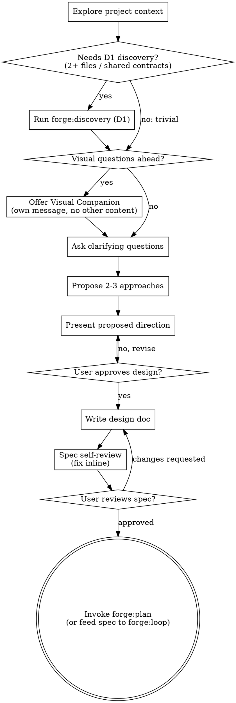

# Brainstorming Ideas Into Designs

Brainstorm is Forge's design-convergence skill. Use it to turn ambiguity into an approved direction or a documented reversible assumption.

It is not a mandatory prelude to every edit. Use the lightest design process that truthfully resolves the ambiguity.

Start by understanding the smallest relevant project context, then narrow the design space, then present the proposed direction.

<HARD-GATE>
Do NOT invoke any implementation skill, write any code, scaffold any project, or take any implementation action while unresolved design choices materially affect what will be built.

If owner input is available, present the design and route the approval/clarification checkpoint through `forge:ask`.

**Autonomous continuation:** When no user is available, follow `forge:ask` semantics: continue only with the smallest safe reversible assumption inside scope, record it, and proceed. Do not invent approval for owner-only decisions.
</HARD-GATE>

## Anti-Pattern: Treating Brainstorm As Mandatory For Every Task

Do not force a full brainstorming workflow onto trivial, fully specified, low-risk edits. If requirements are already concrete and implementation-local, route to Direct, Plan, or Loop instead.

Use brainstorm when the open question is genuinely about design, behavior, or architecture — not when the task merely needs file reading.

## Default Shape For A Brainstorm Turn

When user input is available, a normal brainstorm turn should usually be:

1. smallest relevant context
2. 2-3 approaches
3. one recommendation
4. one `forge:ask` approval or decision checkpoint
5. stop

Do not stretch a single brainstorm turn into section-by-section approvals unless the user explicitly asks for staged review, or there are multiple independent owner decisions that cannot be truthfully collapsed into one checkpoint.

If additional owner decisions remain after choosing the highest-priority one, do not ask them in the same turn. Emit them as:

- `assumptions` for reversible, low-risk defaults
- `deferred decisions` for real open questions that can wait

## Checklist

Use the following sequence as needed. Scale it to ambiguity and risk; do not manufacture ceremony.

**Autonomous mode (no user available):** Still converge the design, but keep it minimal. Ask only the questions that would materially change the implementation. For reversible in-scope decisions, record the assumption and continue rather than blocking.

1. **Explore project context** — check only the smallest relevant files, docs, or recent commits. Default to D0. For changes that may touch 2+ files or shared contracts, invoke `forge:discovery` (D1 depth) only when that evidence will materially change the options or recommendation. This discovery can be reused by a later loop or plan if the work proceeds beyond brainstorm.
2. **Offer visual companion** (if topic will involve visual questions) — this is its own message, not combined with a clarifying question. See the Visual Companion section below.
3. **Ask clarifying questions** — via `forge:ask`, one at a time, and only until one material design checkpoint can be framed
4. **Propose 2-3 approaches** — with trade-offs and your recommendation
5. **Present design** — present the full proposed direction, then use one `forge:ask` checkpoint for the highest-impact unresolved decision; stop unless the user explicitly requested staged review
6. **Write design doc** (optional, multi-step features only) — save to `docs/forge/specs/YYYY-MM-DD-<topic>-design.md` and commit. For single-step fixes or small changes, keep the design in conversation context only.
7. **Spec self-review** (if doc written) — quick inline check for placeholders, contradictions, ambiguity, scope (see below)
8. **User reviews written spec** (if doc written) — ask user to review the spec file before proceeding
9. **Transition to implementation** — once design risk is closed, invoke `forge:plan` or feed the result into `forge:loop`

## Process Flow



**The terminal state is one of two paths.** Do NOT invoke frontend-design,
mcp-builder, or any other implementation skill directly.
- No loop active → invoke `forge:plan` to turn the spec into an implementation plan.
- A `forge:loop` is wrapping this brainstorm → feed the approved spec into the loop
  as Goal/Rubric input (per loop's Brainstorm Boundary); the loop then runs its own
  discovery/plan/execute/verify.

## The Process

**Understanding the idea:**

- Check out the current project state first (files, docs, recent commits). If the
  change likely spans 2+ files or shared contracts, run `forge:discovery` (D1) to
  ground your questions in the real impact surface — this discovery can be reused
  by a later loop or plan.
- If discovery shows the task is already fully specified and there is no meaningful
  design space left, exit brainstorm and route back to Direct, Plan, or Loop.
- If the user asked for a compare-and-decide turn only, stop after the first material recommendation + approval checkpoint. Do not drift into plan writing, spec writing, or follow-on approvals in the same turn.
- If more than one owner decision exists, choose the single highest-leverage one for this turn and classify the rest as `deferred decisions`.
- Before asking detailed questions, assess scope: if the request describes multiple independent subsystems (e.g., "build a platform with chat, file storage, billing, and analytics"), flag this immediately. Don't spend questions refining details of a project that needs to be decomposed first.
- If the project is too large for a single spec, help the user decompose into sub-projects: what are the independent pieces, how do they relate, what order should they be built? Then brainstorm the first sub-project through the normal design flow. Each sub-project gets its own spec → plan → implementation cycle.
- For appropriately-scoped projects, ask the minimum number of questions needed to frame one material decision
- When the question has a known set of likely answers, use `forge:ask` with those answers as options
- For open-ended questions, use `forge:ask` with 2-3 suggested answers as options — the user can always type their own answer
- If no user is available, make reasonable assumptions from project context and proceed
- Only one question per tool call — if a topic needs more exploration, break it into multiple questions
- Focus on understanding: purpose, constraints, success criteria

**Exploring approaches:**

- Propose 2-3 different approaches with trade-offs
- Present options conversationally with your recommendation and reasoning
- Lead with your recommended option and explain why

**Presenting the design:**

- Once you believe you understand what you're building, present the design
- Scale each section to its complexity: a few sentences if straightforward, up to 200-300 words if nuanced
- After presenting the proposed direction, use one `forge:ask` checkpoint for the highest-impact unresolved decision:
  - header: `Design Decision`
  - question: `Does this proposed direction look right?`
  - options:
    - label: `Approve`, description: `Use this direction`
    - label: `Revise`, description: `I want changes`

  If no user is available, treat as approved and continue.
- Cover: architecture, components, data flow, error handling, testing
- Be ready to go back and clarify if something doesn't make sense
- After the decision checkpoint, stop. Do not stack a second approval, planning checkpoint, or implementation kickoff in the same brainstorm turn unless the user explicitly requested staged review.
- If there are remaining open items, list them under `assumptions` or `deferred decisions` instead of asking again.

**Design for isolation and clarity:**

- Break the system into smaller units that each have one clear purpose, communicate through well-defined interfaces, and can be understood and tested independently
- For each unit, you should be able to answer: what does it do, how do you use it, and what does it depend on?
- Can someone understand what a unit does without reading its internals? Can you change the internals without breaking consumers? If not, the boundaries need work.
- Smaller, well-bounded units are also easier for you to work with - you reason better about code you can hold in context at once, and your edits are more reliable when files are focused. When a file grows large, that's often a signal that it's doing too much.

**Working in existing codebases:**

- Explore the current structure before proposing changes. Follow existing patterns.
- Where existing code has problems that affect the work (e.g., a file that's grown too large, unclear boundaries, tangled responsibilities), include targeted improvements as part of the design - the way a good developer improves code they're working in.
- Don't propose unrelated refactoring. Stay focused on what serves the current goal.

## After the Design

**Documentation (optional, multi-step features only):**

For features with multiple tasks or significant architectural decisions:
- Write the validated design (spec) to `docs/forge/specs/YYYY-MM-DD-<topic>-design.md`
  - (User preferences for spec location override this default)
- Use elements-of-style:writing-clearly-and-concisely skill if available
- Commit the design document to git

For single bug fixes or small changes, skip the written spec — the design presented in conversation is sufficient.

**Spec Self-Review (if doc written):**
After writing the spec document, look at it with fresh eyes:

1. **Placeholder scan:** Any "TBD", "TODO", incomplete sections, or vague requirements? Fix them.
2. **Internal consistency:** Do any sections contradict each other? Does the architecture match the feature descriptions?
3. **Scope check:** Is this focused enough for a single implementation plan, or does it need decomposition?
4. **Ambiguity check:** Could any requirement be interpreted two different ways? If so, pick one and make it explicit.

Fix any issues inline. No need to re-review — just fix and move on.

**User Review Gate (if doc written):**
After spec self-review passes, use `forge:ask`:
- header: `Spec Review`
- question: `Spec written and committed to <path>. Ready to proceed?`
- options:
  - label: `Approved`, description: `Proceed to forge:plan`
  - label: `Changes needed`, description: `I have revisions`

If no user is available, treat as approved and invoke forge:plan.

If "Changes needed" or custom feedback, apply changes and re-run spec review. Only proceed on approval.

**Implementation:**

- Invoke forge:plan to create a detailed implementation plan
- Do NOT invoke any other skill. forge:plan is the next step.

## Spec Section Anchors

When writing the spec, give every `##` section heading a stable anchor ID so downstream plan tasks and reviewers can reference exact spec locations. Put the ID at the start of the heading text:

```markdown
## [S1] Problem
## [S2] Solution overview
## [S3] Coverage gate behavior
```

Rules:

- **ID format** is `S` followed by a number (`[S1]`, `[S2]`, `[S3]`, ...), unique within the spec — no two sections share an ID, and no section is left without one.
- **Number sections in document order** when first authoring the spec (top section is `[S1]`, the next is `[S2]`, and so on).
- **The ID is stable.** If a heading is later reworded, keep its existing ID and do NOT renumber the other sections. Downstream `covers:` references and review verdicts depend on these IDs not drifting — renumbering would silently break every reference that points at them.

These anchors are the index the plan and reviewers use to trace each task and each review verdict back to the exact spec section it serves.

## Key Principles

- **One question at a time** - Don't overwhelm with multiple questions
- **Multiple choice preferred** - Easier to answer than open-ended when possible
- **YAGNI ruthlessly** - Remove unnecessary features from all designs
- **Explore alternatives** - Always propose 2-3 approaches before settling
- **Incremental validation** - Present design, get approval before moving on
- **Be flexible** - Go back and clarify when something doesn't make sense

## Visual Companion

A browser-based companion for showing mockups, diagrams, and visual options during brainstorming. Available as a tool — not a mode. Accepting the companion means it's available for questions that benefit from visual treatment; it does NOT mean every question goes through the browser.

**Offering the companion:** When you anticipate visual content (mockups, layouts, diagrams):

1. **No persistent preference** — this setup doesn't have cross-session memory, so we always ask fresh when needed.

2. **Offer consent using `forge:ask`** (this MUST be its own message — do not combine with other content):
   - header: `Visual Companion`
   - question: `Some upcoming questions may benefit from browser-based mockups and diagrams. This feature is token-intensive and requires opening a local URL.`
   - options:
     - label: `Yes, this time`, description: `Enable visuals for this session only`
     - label: `No, this time`, description: `Skip visuals for this session only`

   If no user is available, skip the visual companion and use text-only.

If declined, proceed with text-only brainstorming.

**Per-question decision:** Even after the user accepts, decide FOR EACH QUESTION whether to use the browser or the terminal. The test: **would the user understand this better by seeing it than reading it?**

- **Use the browser** for content that IS visual — mockups, wireframes, layout comparisons, architecture diagrams, side-by-side visual designs
- **Use the terminal** for content that is text — requirements questions, conceptual choices, tradeoff lists, A/B/C/D text options, scope decisions

A question about a UI topic is not automatically a visual question. "What does personality mean in this context?" is a conceptual question — use the terminal. "Which wizard layout works better?" is a visual question — use the browser.

If they agree to the companion, read the detailed guide before proceeding:
`<forge:brainstorm>/visual-companion.md`
