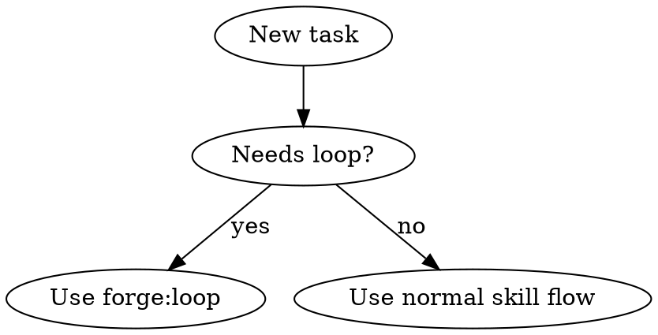

# Closed-Loop Delivery

## Overview

Forge loop turns a request into a bounded delivery cycle: decide whether a loop is
needed, define the acceptance rubric, execute, verify, and iterate until the rubric
passes or a real blocker appears.

**Core principle:** The loop is not "keep trying." It is a bounded system with a goal,
rubric, evidence, memory checkpoints, and explicit stop conditions.

## Auto-Start Decision

Run this decision before choosing ordinary direct execution.



Start `forge:loop` when ANY are true:

- The task has 2+ steps, 2+ files, or cross-module effects.
- Success depends on more than one command, test, or reviewer judgment.
- Requirements are ambiguous enough to need an explicit acceptance rubric.
- Verification may fail and require another implementation pass.
- The task is delegated to subagents or uses `mission`-style autonomy.
- The user asks for end-to-end delivery, productization, hardening, or "best practice".

Do NOT start a loop when ALL are true:

- Single-file trivial edit, typo, formatting, or documentation wording only.
- No ambiguity, no review risk, and one verification command is enough.
- The user explicitly asks for analysis or a plan only.

If unsure, start the loop. The first loop step can downgrade to normal flow.

## Loop Contract

Before executing work, establish this contract in your own context or via
`forge-check` for larger tasks:

```markdown
Goal: <user outcome>
Rubric:
- [ ] <objective acceptance criterion>
- [ ] <constraint or non-goal>
Budget: <turns/time/retries if known>
Stop conditions: pass | blocked | owner decision required
```

Rubric items must be objective enough to verify with commands, diff evidence,
reviewer verdicts, screenshots, logs, or explicit user approval.

## The Loop

1. **Goal:** Restate the user outcome and boundary. If the goal is unclear, use
   `forge:ask` with concrete options.
2. **Rubric:** Derive acceptance criteria from the request, specs, plan, regression
   symptoms, and relevant rules. Include non-goals to stop scope creep.
3. **Discover:** Read the smallest code/docs slice needed to avoid guessing.
4. **Plan:** Use `forge:plan` for multi-step work; otherwise keep a short local plan.
5. **Execute:** Use the normal implementation skills (`forge:subagent`, `forge:tdd`,
   `forge:debug`, or direct edits for trivial cases).
6. **Verify:** Invoke `forge:verify`. The verdict must be `pass`, `fail`, or `blocked`
   against the rubric.
7. **Iterate:** If `fail`, turn failed rubric items into the next implementation prompt,
   execute, and verify again. If `blocked`, use `forge:ask` or stop with the blocker.
8. **Ship:** Only after a `pass` verdict, continue to `forge:report` or `forge:merge`.

## Memory Checkpoints

Use `forge-check` at natural loop boundaries for non-trivial work:

- `loop-start`: goal, rubric, budget, initial plan
- `iteration-N`: what changed in this pass
- `verify-failed`: failed/unverifiable rubric items and next prompt
- `ship-ready`: pass verdict, evidence, residual risks

Do not rely on chat memory for loop state that another session may need.

## Iteration Prompt Pattern

When verification fails, write the next prompt from evidence, not vibes:

```markdown
Continue the loop for <goal>.
Failed rubric items:
- <item> — evidence: <test/reviewer/file output>
Constraints:
- Preserve already-passing rubric items.
- Do not expand scope beyond <non-goals>.
Required verification after fix:
- <commands/review checks>
```

## Common Mistakes

| Mistake | Fix |
|---------|-----|
| Starting a loop without a rubric | Define objective pass/fail criteria first |
| Treating tests as the whole rubric | Include requirements, review, and risk gates |
| Asking "should I continue?" after a fail | Iterate automatically unless blocked |
| Repeating the same failed approach | Change the prompt based on failure evidence |
| Keeping loop state only in chat | Write `forge-check` checkpoints |
| Letting open-ended tasks run forever | Set budget and stop conditions |

## Relationship To Other Skills

- **Before loop:** `forge:brainstorm` when product/design ambiguity exists.
- **Inside loop:** `forge:plan`, `forge:subagent`, `forge:tdd`, `forge:debug`.
- **Loop gate:** `forge:verify` decides pass/fail/blocked.
- **After pass:** `forge:report`, then `forge:merge` when integration is requested.

If another skill has a stricter rule, follow the stricter rule.
