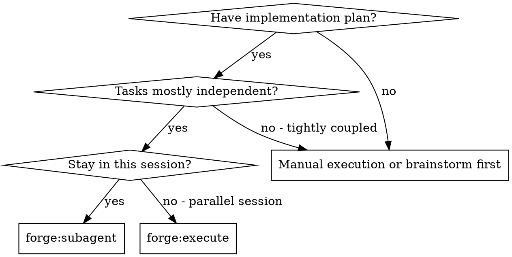
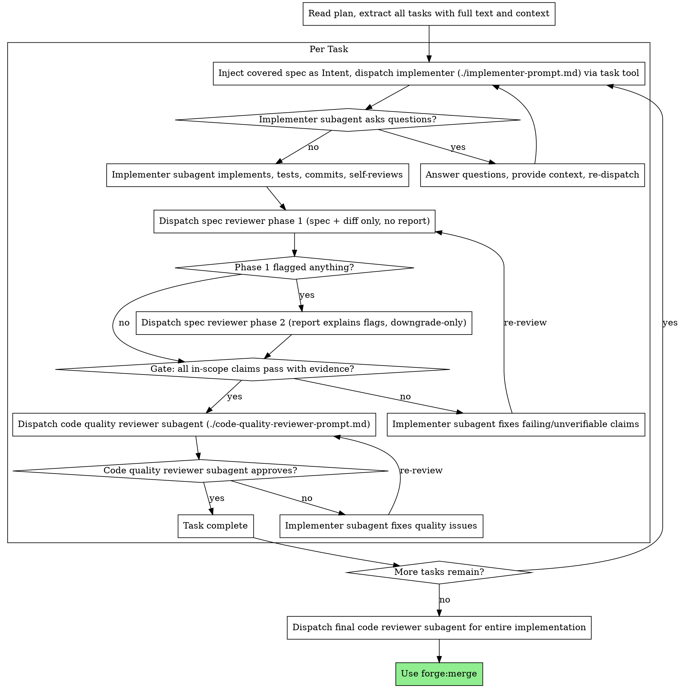

# Subagent-Driven Development

Execute plan by dispatching fresh subagent per task via the `task` tool, with two-stage review after each: spec compliance review first, then code quality review.

**Why subagents:** You delegate tasks to specialized agents with isolated context. By precisely crafting their instructions and context, you ensure they stay focused and succeed at their task. They should never inherit your session's context or history — you construct exactly what they need. This also preserves your own context for coordination work.

**Core principle:** Fresh subagent per task + two-stage review (spec then quality) = high quality, fast iteration

**Continuous execution:** Do not pause to check in with your human partner between tasks. Execute all tasks from the plan without stopping. The only reasons to stop are: BLOCKED status you cannot resolve, ambiguity that genuinely prevents progress, or all tasks complete. "Should I continue?" prompts and progress summaries waste their time — they asked you to execute the plan, so execute it. When you must stop for ambiguity or a blocker, use `forge:ask` to present the situation with structured options. If no user is available, resolve it with your best judgment and continue.

## When to Use



**vs. Executing Plans (parallel session):**
- Same session (no context switch)
- Fresh subagent per task (no context pollution)
- Two-stage review after each task: spec compliance first, then code quality
- Faster iteration (no human-in-loop between tasks)

## Complexity Routing

Read each plan task's `Complexity:` tag before dispatching.

| Complexity | Orchestrator action |
|------------|---------------------|
| `trivial` | Edit directly in the controller, then run targeted verification. No subagent. |
| `standard` | Dispatch implementer, then spec review. Add code quality review when risk warrants it. |
| `complex` | Dispatch implementer, spec review, and code quality review. |

If a task lacks a tag, infer the cheapest safe path. Treat cross-module contracts,
security, data, performance, and UI flows as `complex` unless evidence says otherwise.

## Trivial Fix Path

Not every review finding deserves a new subagent. Use this tiered rule:

| Fix size | Action |
|----------|--------|
| Trivial: ≤ 5 lines, 1-2 files, no public contract change | Controller edits directly, runs focused verification, and records the reason. |
| Small: 5-30 lines or local behavior change | Dispatch a fix subagent, then spec review only. |
| Refactor: > 30 lines, cross-module, public API, or risk-bearing | Full implementer → spec review → code quality loop. |

Direct trivial fixes are allowed because avoiding subagent overhead is safer than
over-processing obvious one-line corrections. Never use this path for uncertain fixes.

## The Process



## Spec-Anchored Review Gate

This is how each task's spec-compliance review works. It replaces a single
prose review with intent-grounded implementation and a two-phase, evidence-gated
verdict.

**1. Inject intent before dispatching the implementer.** Read the task's `Covers:`
field, pull the verbatim text of those `[Sn]` spec sections, and paste it into the
implementer prompt's `## Intent (from spec)` block (see `./implementer-prompt.md`).
The implementer never reads the spec itself — you hand it exactly the sections its
task covers, with the scope boundary intact.

Then dispatch via the `task` tool (opencode-native subagent spawn):

```
task(
  description: "<3-5 word summary>",
  prompt: "<full implementer prompt with Intent block + scaffold + ./implementer-prompt.md content>",
  subagent_type: "general"
)
```

The implementer subagent runs in an isolated context, sees ONLY what you put in
the prompt, and returns a status report.

**2. Run the spec reviewer in two phases** (see `./spec-reviewer-prompt.md`):
- **Phase 1:** dispatch with the covered spec section text + `git diff` ONLY. Do NOT
  include the implementer's report — its claims anchor the reviewer toward confirming
  what was reported and away from spotting silent omissions. Phase 1 returns a
  structured per-claim verdict.
- **Phase 2:** only if phase 1 flagged anything. Re-dispatch the same reviewer with
  its phase-1 verdict + the implementer's report, solely to let the report explain
  flagged diffs. Phase 2 may downgrade a flagged item; it cannot add passes.

**3. Gate on the verdict.** The task is complete ONLY when the final verdict is
`Status: pass` AND every `in-scope` claim is `status: pass` with evidence. Any
`fail` or `unverifiable` in-scope claim → re-dispatch the implementer with the
specific failing claims, then re-review. Loop until the gate passes. Then run the
code quality review (spec compliance always precedes quality), and once that also
passes, the task is complete.

A structured `pass` without verifiable evidence (test name, command output, or
`file:line`) does not satisfy the gate — treat it as `fail`. Prose is not evidence.

## Model Selection

Use the least powerful model that can handle each role to conserve cost and increase speed.

**Mechanical implementation tasks** (isolated functions, clear specs, 1-2 files): use a fast, cheap model. Most implementation tasks are mechanical when the plan is well-specified.

**Integration and judgment tasks** (multi-file coordination, pattern matching, debugging): use a standard model.

**Architecture, design, and review tasks**: use the most capable available model.

**Task complexity signals:**
- Touches 1-2 files with a complete spec → cheap model
- Touches multiple files with integration concerns → standard model
- Requires design judgment or broad codebase understanding → most capable model

**Reviewer tier:** Dispatch the spec reviewer at a model tier at least as capable as
the implementer's. A reviewer weaker than the implementer shares its blind spots and
rubber-stamps the same misreadings; the adversarial value of review comes from the
reviewer interpreting the spec independently, which a weaker model cannot reliably do.

## Handling Implementer Status

Implementer subagents report one of four statuses. Handle each appropriately:

**DONE:** Proceed to spec compliance review.

**DONE_WITH_CONCERNS:** The implementer completed the work but flagged doubts. Read the concerns before proceeding. If the concerns are about correctness or scope, address them before review. If they're observations (e.g., "this file is getting large"), note them and proceed to review.

**NEEDS_CONTEXT:** The implementer needs information that wasn't provided. Provide the missing context and re-dispatch.

**BLOCKED:** The implementer cannot complete the task. Assess the blocker:
1. If it's a context problem, provide more context and re-dispatch with the same model
2. If the task requires more reasoning, re-dispatch with a more capable model
3. If the task is too large, break it into smaller pieces
4. If the plan itself is wrong, escalate to the human

**Never** ignore an escalation or force the same model to retry without changes. If the implementer said it's stuck, something needs to change.

## Progress Snapshot

For plans with more than five tasks, produce a compact status snapshot after every
major milestone or when the user asks "where are we?":

```markdown
Progress: T1-Tn done · Tm-Tz pending · <count> subagents dispatched
Spec review: <passed>/<reviewed> passed · <failures> open
Code quality: <passed>/<reviewed> passed · <failures> open
Estimated remaining: <rough count> dispatches based on complexity tags
```

Use `punchcard`, `git log --oneline`, and your task list as evidence. If the count is
estimated, label it as estimated.

## Tool Edit Fallback

When an edit tool fails because context does not match, use this fallback chain. Do not
repeat the same failed edit more than twice.

1. Re-read the target file range in the current session.
2. Try a smaller single-line edit.
3. Try a narrower multi-line edit around stable anchors.
4. Rewrite the whole file only if you have just read the full file and it is small enough.
5. Use a small script only when the transformation is mechanical and reviewed.
6. Ask via `forge:ask` if the safe path is unclear.

## Prompt Templates

- `./implementer-prompt.md` - Dispatch implementer subagent
- `./spec-reviewer-prompt.md` - Dispatch spec compliance reviewer (two-phase, evidence-gated verdict)
- `./code-quality-reviewer-prompt.md` - Dispatch code quality reviewer subagent

## Dispatching Subagents — Tool Reference

The `task` tool is the **only** way to spawn a subagent. Its schema:

```
task(
  description: <3-5 word summary>,           // required
  prompt: <full prompt text>,                // required, full task spec
  subagent_type: <agent name>,               // required, use "general" by default
  task_id: <existing session id>             // optional, ONLY for resuming prior subagent
  background: <true/false>                   // optional, fire-and-forget
)
```

**You do NOT** use any other syntax (no `task run`, no `task spawn`, no shell-style verbs). Read the `task` tool's own description at runtime for the exact current schema.

**DO NOT** try to bind subagent calls to a T1/T1.1 work-item — there is no task-management tool. Just dispatch via `task` and track progress in your own context.

## Example Workflow

```
You: I'm using Subagent-Driven Development to execute this plan.

[Read plan file once: docs/forge/plans/feature-plan.md]
[Extract all 5 tasks with full text and context]

Task 1: Hook installation script

[Get Task 1 text and context (already extracted)]
[Build implementer prompt: scaffold + Task 1 text + Intent block (covered [Sn] sections)]
[Dispatch via task tool: description="Implement hook install", prompt=<built prompt>, subagent_type="general"]

Implementer: "Before I begin - should the hook be installed at user or system level?"

You: "User level (~/.config/opencode/forge/hooks/)"
[Re-dispatch with the answer added to the prompt]

Implementer:
  - Implemented install-hook command
  - Added tests, 5/5 passing
  - Self-review: Found I missed --force flag, added it
  - Committed

[Dispatch spec reviewer phase 1: spec sections + diff only, no report]
Spec reviewer (phase 1):
  Status: pass
  Claims: [S1 · "install at user level"] in-scope · pass — evidence: test "installs to ~/.config" 5/5
[Phase 1 all-pass → skip phase 2; gate passes]

[Dispatch code quality reviewer]
Code reviewer: Strengths: Good test coverage, clean. Issues: None. Approved.

[Gate passed → Task 1 complete]

Task 2: Recovery modes

[Get Task 2 text and context]
[Build implementer prompt with Intent for [S4] section]
[Dispatch via task tool]

Implementer: [No questions, proceeds]
Implementer:
  - Added verify/repair modes
  - 8/8 tests passing
  - Self-review: All good
  - Committed

[Dispatch spec reviewer phase 1: spec sections + diff only, no report]
Spec reviewer (phase 1):
  Status: fail
  Claims:
    - [S4 · "report every 100 items"] in-scope · fail — evidence: no progress code in diff (omission)
    - [S4 · "verify/repair modes"] in-scope · pass — evidence: test "repairs index" 8/8
  Extra work: --json flag (no covered claim requires it)
[Phase 1 flagged items → dispatch phase 2 with report]
Spec reviewer (phase 2): report gives no justification for --json; progress still missing — Status: fail
[Gate blocks: in-scope fail]

[Re-dispatch implementer with the failing claim: "add progress reporting, remove --json"]
[Implementer fixes]
[Re-dispatch phase 1]
Spec reviewer (phase 1): Status: pass — all in-scope claims pass with evidence
[Gate passes]

[Dispatch code quality reviewer]
Code reviewer: Strengths: Solid. Issues (Important): Magic number (100)

[Re-dispatch implementer: "extract PROGRESS_INTERVAL constant"]
[Implementer fixes]

[Code reviewer reviews again]
Code reviewer: ✅ Approved

[Task 2 complete]

...

[After all tasks]
[Dispatch final code-reviewer]
Final reviewer: All requirements met, ready to merge

Done!
```

## Advantages

**vs. Manual execution:**
- Subagents follow TDD naturally
- Fresh context per task (no confusion)
- Parallel-safe (subagents don't interfere)
- Subagent can ask questions (before AND during work)

**vs. Executing Plans:**
- Same session (no handoff)
- Continuous progress (no waiting)
- Review checkpoints automatic

**Efficiency gains:**
- No file reading overhead (controller provides full text)
- Controller curates exactly what context is needed
- Subagent gets complete information upfront
- Questions surfaced before work begins (not after)

**Quality gates:**
- Self-review catches issues before handoff
- Two-stage review: spec compliance, then code quality
- Review loops ensure fixes actually work
- Spec compliance prevents over/under-building
- Code quality ensures implementation is well-built

**Cost:**
- More subagent invocations (implementer + 2 reviewers per task)
- Controller does more prep work (extracting all tasks upfront)
- Review loops add iterations
- But catches issues early (cheaper than debugging later)

## Red Flags

**Never:**
- Start implementation on main/master branch without explicit user consent
- Skip reviews (spec compliance OR code quality)
- Proceed with unfixed issues
- Dispatch multiple implementation subagents in parallel (conflicts)
- Make subagent read plan file (provide full text instead)
- Skip scene-setting context (subagent needs to understand where task fits)
- Ignore subagent questions (answer before letting them proceed)
- Accept "close enough" on spec compliance (spec reviewer found issues = not done)
- Skip review loops (reviewer found issues = implementer fixes = review again)
- Let implementer self-review replace actual review (both are needed)
- **Start code quality review before spec compliance is ✅** (wrong order)
- Move to next task while either review has open issues
- Pass the spec gate on a `status: pass` that has no verifiable evidence (test/exec/file:line)
- Include the implementer's report in the phase-1 spec review context
- Mark a task complete while any in-scope claim is `fail` or `unverifiable`

**If subagent asks questions:**
- Answer clearly and completely
- Provide additional context if needed
- Don't rush them into implementation

**If reviewer finds issues:**
- Implementer (same subagent) fixes them
- Reviewer reviews again
- Repeat until approved
- Don't skip the re-review

**If subagent fails task:**
- Apply the Trivial Fix Path above.
- For non-trivial failures, dispatch a fix subagent with specific instructions.
- Do not manually refactor uncertain or cross-module failures; that creates context pollution.

## Integration

**Required workflow skills:**
- **forge:worktree** - Ensures isolated workspace (creates one or verifies existing)
- **forge:plan** - Creates the plan this skill executes
- **forge:review** - Code review template for reviewer subagents
- **forge:merge** - Complete development after all tasks

**Subagents should use:**
- **forge:tdd** - Subagents follow TDD for each task

**Important: Passing skills to subagents**

Forge skills appear in subagents' `available_skills` list (the orchestrator's skill block is NOT inherited, but skills in `~/.config/opencode/forge-skills/` are global). If a subagent needs a specific skill, mention it explicitly in the subagent's prompt (e.g., "follow the forge:tdd skill for this task") and the subagent will invoke it.

**Alternative workflow:**
- **forge:execute** - Use for parallel session instead of same-session execution
