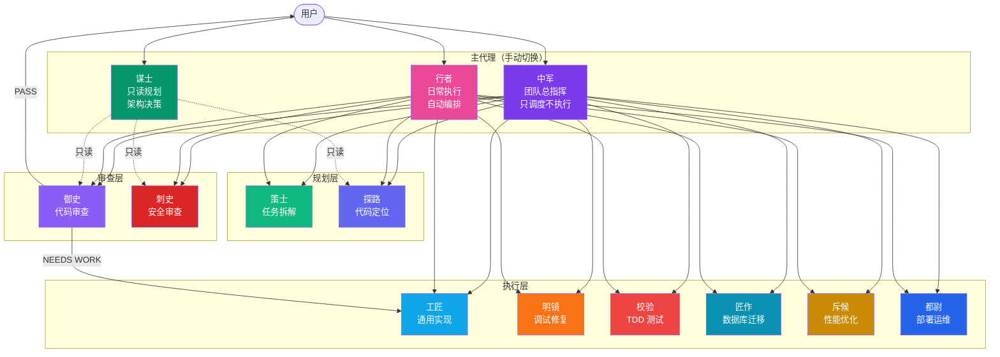

# Open Agent

### 为 OpenCode 深度定制的多代理工作流引擎

`多代理编排` | `Plan-Execute-Review` | `审查门机制` | `自适应修复循环`

---

**Open Agent** 是一套专为 OpenCode 打造的高级多代理协同开发系统。它通过引入 **中军**（团队总指挥）、**行者**（日常执行）、**谋士**（宏观决策）三主控核心，并协同 **10 个专长领域子代理**，将传统的单 Agent 编程模式升级为真正意义上的 AI 全栈软件工程团队，实现 Plan → Execute → Review 的全闭环自主协作。

[特性说明](#特性) • [架构拓扑](#架构总览) • [代理定义](#代理一览) • [预置工作流](#工作流) • [快速安装](#快速开始)

---

## 特性

- **3 主代理 + 10 子代理** — 从规划到部署，每个阶段都有专长代理负责
- **9 种预置工作流** — feature / bugfix / refactor / TDD / 安全 / 数据库 / 性能 / 部署，一条命令启动
- **审查门机制** — 每个工作流以代码审查收尾，不通过则自动进入修复循环（上限 3 次）
- **权限隔离** — 只读代理无法修改代码，可写代理受 scope 约束，危险操作需确认
- **结构化交接** — 代理间通过 HANDOFF 协议传递上下文，信息不丢失
- **双入口兼容** — `@中军` 团队编排模式和 `@行者` 日常执行模式可无缝切换

---

## 架构总览



---

## 代理一览

### 主代理

用户通过 `Tab` 键在主代理间切换（需配置 `tui.json`）。

| 代理 | 颜色 | 模式 | 读写 | 职责 |
|------|------|------|------|------|
| **中军** | 紫 | Supervisor | 只读 | 团队总指挥，统筹 Plan-Execute-Review 闭环，只调度不执行 |
| **行者** | 粉 | Build | 可写 | 日常执行入口，简单任务直接完成，复杂任务自动切换编排模式 |
| **谋士** | 绿 | Plan | 只读 | 宏观架构决策与风险权衡，产出可执行计划后交给行者实施 |

### 子代理

由主代理通过 `task` 工具调度，不需要用户手动调用。

| 代理 | 颜色 | 读写 | 专长 | 调用场景 |
|------|------|------|------|----------|
| **策士** | 翠 | 只读 | 任务拆解与子代理分派 | 复杂任务规划 |
| **探路** | 靛 | 只读 | 代码定位、调用链追踪 | 找文件、理解代码 |
| **御史** | 堇 | 只读 | 正确性 / 性能 / 可维护性审查 | 所有工作流的最终审查门 |
| **刺史** | 赤 | 只读 | 安全专项审查（OWASP Top 10） | 涉及认证 / 支付 / PII |
| **明镜** | 橙 | 可写 | 调试定位、根因分析、最小修复 | Bug 修复 |
| **校验** | 红 | 可写 | TDD 测试、回归验证 | 补测试、验证修复 |
| **工匠** | 蓝 | 可写 | 边界明确的小块实现 | 功能开发、重构 |
| **匠作** | 青 | 可写 | Schema / 索引 / 迁移 / 回滚 | 数据库变更 |
| **斥候** | 黄 | 可写 | 性能分析与优化方案 | 性能调优 |
| **都尉** | 蓝 | 可写 | CI/CD / Docker / K8s / 监控 | 部署运维 |

---

## 工作流

通过 `/orchestrate` 命令启动预置工作流，每个工作流由代理链 -> 审查门 -> 修复循环组成。

| 工作流 | 命令 | 代理链 | 审批门 |
|--------|------|--------|--------|
| **功能开发** | `/orchestrate feature` | 策士 -> 工匠 -> 校验 -> 御史 | 策士之后 |
| **TDD 开发** | `/orchestrate feature-tdd` | 策士 -> 校验 -> 御史 | 策士之后 |
| **Bug 修复** | `/orchestrate bugfix` | 明镜 -> 校验 -> 御史 | — |
| **重构** | `/orchestrate refactor` | 策士 -> 工匠 -> 御史 | 策士之后 |
| **UI 设计** | `/orchestrate ui-design` | 策士 -> 工匠 -> 御史 | 策士之后 |
| **安全功能** | `/orchestrate secure-feature` | 策士 -> 工匠 -> [刺史 ‖ 御史] | 策士之后 |
| **数据库功能** | `/orchestrate db-feature` | 策士 -> 匠作 -> 工匠 -> 御史 | 策士之后 |
| **性能审计** | `/orchestrate performance-audit` | 明镜 -> 斥候 -> 工匠 -> 御史 | — |
| **部署** | `/orchestrate deploy` | 策士 -> 都尉 -> 御史 | 策士之后 |

还可以用 `custom` 模式自定义代理链：

```
/orchestrate custom "策士,工匠,刺史,御史" "实现用户认证模块"
```

### 审查门与修复循环

```
代理链执行 -> 御史审查 -> PASS? ─── 是 -> 交付
                          │
                          否
                          ↓
                  修复负责人修复 -> 御史重审 -> ... (上限 3 次)
                                              │
                                         3 次仍未过 -> BLOCKED
```

---

## 快速开始

### 前置条件

- [OpenCode](https://github.com/anomalyco/opencode) 已安装并可用
- OpenCode 全局配置目录：`~/.config/opencode`（Linux/macOS）或 `%USERPROFILE%\.config\opencode`（Windows）

### 安装

**1. 克隆仓库**

```bash
git clone https://github.com/JochenYang/open-agent.git
cd open-agent
```

**2. 复制配置到 OpenCode 全局目录**

Linux / macOS：

```bash
# 复制主配置
cp opencode.json ~/.config/opencode/opencode.json
cp tui.json ~/.config/opencode/tui.json

# 复制代理定义
mkdir -p ~/.config/opencode/agents
cp .opencode/agents/*.md ~/.config/opencode/agents/

# 复制工作流命令
mkdir -p ~/.config/opencode/commands
cp .opencode/commands/*.md ~/.config/opencode/commands/
```

Windows（PowerShell）：

```powershell
# 复制主配置
Copy-Item opencode.json "$env:USERPROFILE\.config\opencode\opencode.json"
Copy-Item tui.json "$env:USERPROFILE\.config\opencode\tui.json"

# 复制代理定义
New-Item -ItemType Directory -Force "$env:USERPROFILE\.config\opencode\agents"
Copy-Item .opencode\agents\*.md "$env:USERPROFILE\.config\opencode\agents\"

# 复制工作流命令
New-Item -ItemType Directory -Force "$env:USERPROFILE\.config\opencode\commands"
Copy-Item .opencode\commands\*.md "$env:USERPROFILE\.config\opencode\commands\"
```

**3. 验证安装**

重启 OpenCode 后运行：

```bash
opencode agent list
```

应看到 `行者 (primary)`、`谋士 (primary)`、`中军 (primary)` 和 10 个子代理，内置的 `build`、`plan`、`general`、`explore` 已被禁用。

---

## 配置说明

### `opencode.json`

```jsonc
{
  "default_agent": "行者",        // 默认使用行者作为主代理
  "agent": {
    "build": { "disable": true },  // 禁用内置代理
    "plan": { "disable": true },
    "general": { "disable": true },
    "explore": { "disable": true }
  },
  "permission": {
    "bash": {
      "git push*": "ask",          // 危险操作需确认
      "rm *": "ask",
      "*": "allow"                 // 其他命令自动允许
    }
  }
}
```

### `tui.json`

```jsonc
{
  "keybinds": {
    "switch_agent": "tab"  // Tab 键在主代理间切换
  }
}
```

---

## 设计理念

### 为什么需要多代理？

单一 Agent 在处理复杂任务时容易出现：

- **角色混乱** — 同一个 Agent 既规划又实现又审查，容易自己批准自己
- **scope 漂移** — 修改时顺手改了不相关的代码
- **缺乏验证** — 改完就算完，没有独立审查环节

Open Agent 用分工解决这些问题：

| 原则 | 实现 |
|------|------|
| **职责分离** | 规划者不写代码，审查者不修改，执行者不扩 scope |
| **权限最小化** | 只读代理物理层面无法写入，危险命令需确认 |
| **独立审查** | 所有工作流必须经过御史审查，审查不过就修，修不过就报 |
| **有限重试** | 修复循环上限 3 次，防止无限循环 |
| **上下文传递** | HANDOFF 协议确保代理间信息完整传递 |

### 三种使用姿势

| 场景 | 入口 | 说明 |
|------|------|------|
| 日常开发 | `@行者` | 简单任务直接做，复杂任务自动编排 |
| 架构决策 | `@谋士` | 只分析不动手，产出方案后切到行者执行 |
| 团队编排 | `@中军` | 完整的 Plan-Execute-Review 闭环统筹 |

---

## 项目结构

```
open-agent/
├── opencode.json               # OpenCode 全局配置（禁用内置代理 + 权限规则）
├── tui.json                    # TUI 快捷键配置
└── .opencode/
    ├── agents/                 # 代理定义（13 个 .md 文件）
    │   ├── 中军.md             #   primary  — 团队总指挥
    │   ├── 行者.md             #   primary  — 日常执行
    │   ├── 谋士.md             #   primary  — 只读规划
    │   ├── 策士.md             #   subagent — 任务拆解
    │   ├── 探路.md             #   subagent — 代码定位
    │   ├── 御史.md             #   subagent — 代码审查
    │   ├── 明镜.md             #   subagent — 调试修复
    │   ├── 校验.md             #   subagent — TDD 测试
    │   ├── 工匠.md             #   subagent — 通用实现
    │   ├── 刺史.md             #   subagent — 安全审查
    │   ├── 匠作.md             #   subagent — 数据库迁移
    │   ├── 斥候.md             #   subagent — 性能优化
    │   └── 都尉.md             #   subagent — 部署运维
    └── commands/
        └── orchestrate.md      # /orchestrate 工作流引擎定义
```

---

## 贡献

欢迎任何形式的贡献！

- **报告问题** — 提 Issue 描述你遇到的问题或建议
- **改进代理** — 优化代理 prompt、补充边界条件处理
- **新增工作流** — 在 `orchestrate.md` 中添加新的工作流类型
- **新增代理** — 在 `.opencode/agents/` 中添加新的专长子代理

提交时请遵循 commit 规范：`<type>(<scope>): <subject>`

---

## 协议

[MIT](./LICENSE) © 2026 Jochenyang open-agent contributors
